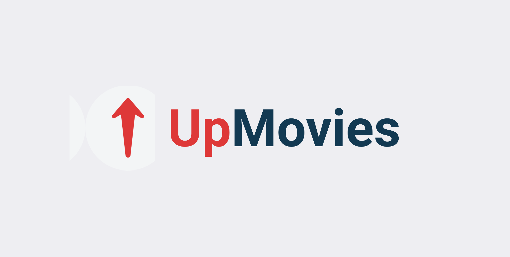
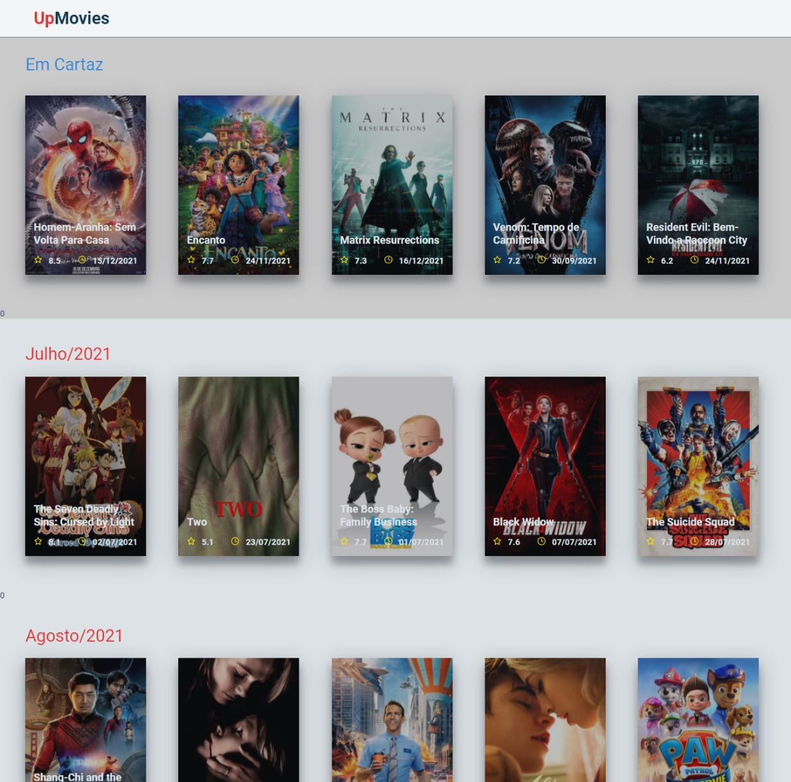
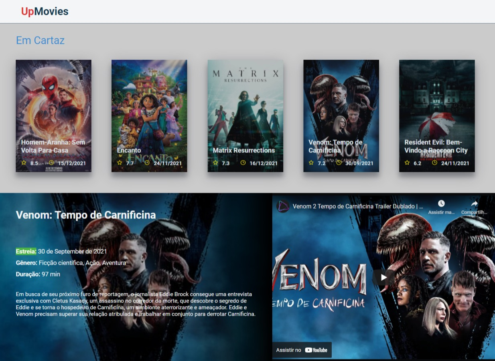
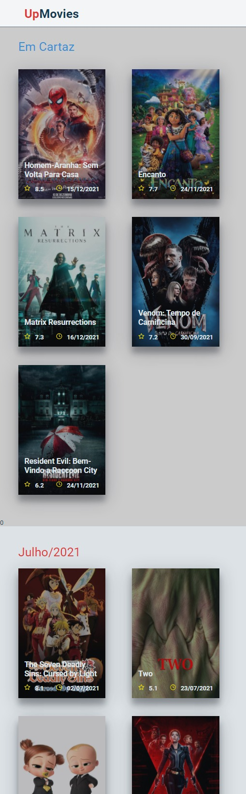
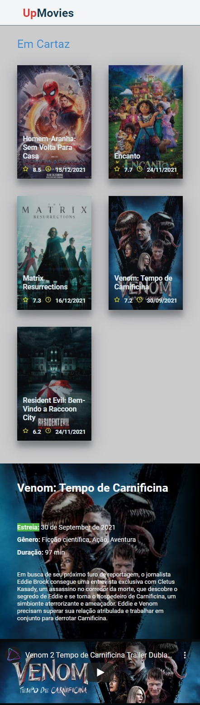

<h1 align="center">
    
</h1>

<h2 align="center">

[](https://github.com/pauloreis7/UpMovies/issues)
[](https://github.com/pauloreis7/UpMovies)
[](https://github.com/pauloreis7/UpMovies/commits)
[](https://github.com/pauloreis7/UpMovies/stargazers)
[](https://github.com/pauloreis7/UpMovies/blob/master/LICENSE)

</h2>

<h1 align="center">
    
</h1>

<h4 align="center">🏁 Aplicação já finalizada 🏁</h4>

<p align="center">🎥 Aplicação completa para listagem de filmes que estão em cartaz 🎬</p>

## 🔗 Index
---
 <p>👉 <a href="#about">Sobre o projecto</a> </p>
 <p>👉 <a href="#layout">Layout de aplicação</a> </p>
 <p>👉 <a href="#func">Funcionalidades</a> </p>
 <p>👉 <a href="#techs">Tecnologias</a> </p>
 <p>👉 <a href="#requests">Pré-requisitos do projeto</a> </p>
 <p>👉 <a href="#work">Download e execução</a> </p>
 <p>👉 <a href="#contribute">Contribua com o projecto</a> </p>
 <p>👉 <a href="#author">Autor</a> </p>
 <p>👉 <a href="#license">Licença</a> </p>

<a id="about"></a>
## 🔎 Sobre o projecto
---
<p>Aplicação completa e responsiva para listagem de filmes dos últimos meses, exibe os principais detalhes de cada filme da listagem.</p>

<a id="layout"></a>
## 🎨 Layout de aplicação
---
<p align="center">

### 💻 Homepage 




### 📱 Mobile



</p>

<a id="func"></a>
## ✅ Funcionalidades
---
- [x] API REST
- [x] Responsividade
- [x] HomePage
- [x] Testes automatizados
- [x] Listagem dos filmes lançados nos últimos seis meses
- [x] Exibe detalhes de qualquer filme selecionado
- [x] Integração com a API do The Movie DB
- [x] Interface animada

<a id="techs"></a>
## 🧪 Tecnologias
---
### 💻 Projeto desenvolvido com as seguintes tecnologias

- [TypeScript](https://www.typescriptlang.org/)
- [React](https://reactjs.org/)
- [styled-components](https://styled-components.com/)
- [Vite](https://vitejs.dev/)
- [Axios](https://axios-http.com/)
- [Framer motion](https://www.framer.com/motion/)

<a id="requests"></a>
## 🚨 Pré-requisitos do projeto
---
 Antes de começar, é necessário as seguintes ferramentas instaladas na sua máquina:

* [Git](https://git-scm.com)
* [Yarn](https://yarnpkg.com/)

💡 Além disso, é importante ter um editor para se trabalhar com o código, como [VSCode](https://code.visualstudio.com/)

<a id="work"></a>
## 🏄‍♂️ Download e execução
---

````bash

# Clone o repositório
$ git clone <https://github.com/pauloreis7/UpMovies>

# Acessar a pasta do projeto pelo terminal/cmd
$ cd UpMovies

# Abra o projeto no VSCode
$ code .

# Instalar as dependências do projeto
yarn install

# Inicie a aplicação Web
$ yarn dev

# A aplicação vai iniciar na porta:3000
acesse  <http://localhost:3000>

````

<a id="contribute"></a>
## 🎉 Como contribuir

[](https://github.com/pauloreis7/UpMovies/pulls)

---

<b>1. Faça um Fork do projeto.</b> <br />
<b>2. Crie uma nova branch com suas mudanças: git 3. checkout -b my-feature</b> <br />
<b>3. Salve suas alterações e crie um commit contando o que fez: git commit -m "feature: My new feature</b> <br />
<b>4. Envie as suas alterações: git push origin my-feature</b>


<a id="author"></a>
## Autor
---

## 👨‍💻 Autor

<a href="https://github.com/pauloreis7">


<b>Paulo Reis</b> 🏆 

</a>

<p>Feito por Paulo Reis 🤴 Contacte-me 👋</p>

<a href = "mailto:paulosilvadosreis2057@gmail.com"></a>
<a href="https://www.linkedin.com/in/paulo-reis7/" target="_blank"></a>
<a href="https://www.instagram.com/pauloreis.7" target="_blank"></a>

<a id="license"></a>
## 📝 Licença
---
Este projeto está sob a licença do MIT. Veja o arquivo [LICENSE](LICENSE) para mais detalhes 🏛️
